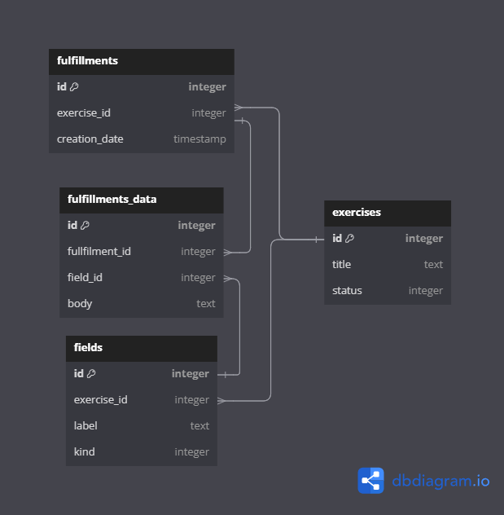

# Database schema

Here is the database structure we want to use, you can use https://dbdiagram.io/ to render the diagram from source code below.



## DBML

```dbml
// Use DBML to define your database structure
// Docs: https://dbml.dbdiagram.io/docs

Table exercises {
  id serial [primary key]
  title text
  status integer //0:Building 1:Answering 2:Closed
}

Table fields {
  id serial [primary key]
  exercise_id integer
  label text
  kind integer // 0:Single line text 1:List of single lines 2:Multi-line text
}

Table fulfillments {
  id serial [primary key]
  exercise_id integer
  creation_date timestamp

}

Table fulfillments_data {
  id serial [primary key]
  fulfilment_id integer
  field_id integer
  body text //raw data with \n to separate lines
}

Ref: fields.exercise_id > exercises.id
Ref: fulfillments.exercise_id > exercises.id
Ref: fulfillments.id < fulfillments_data.fulfilment_id
Ref: fields.id < fulfillments_data.field_id
```